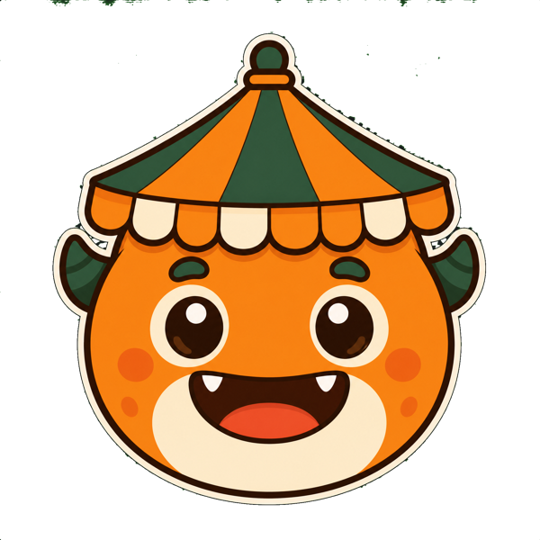
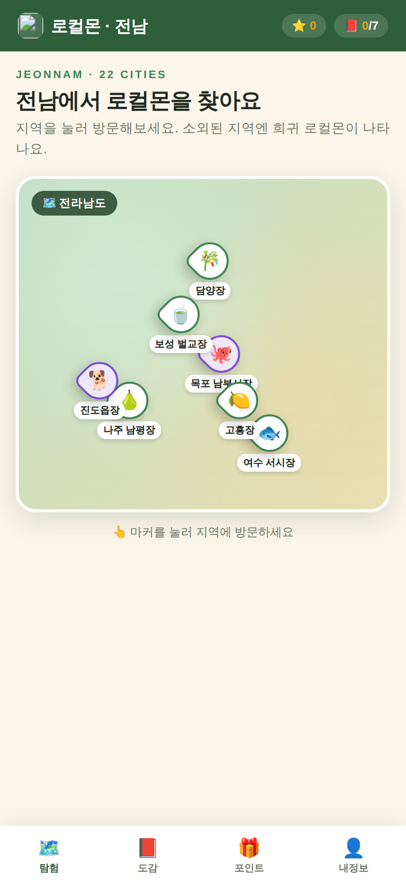
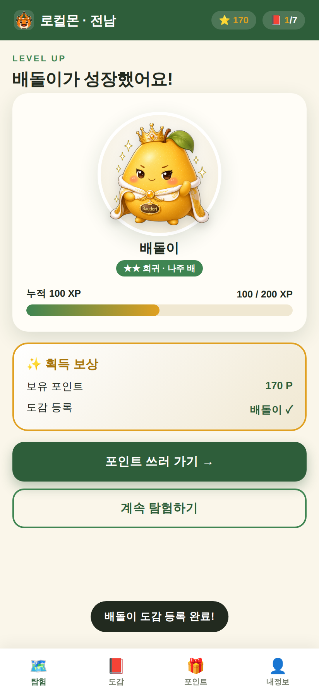
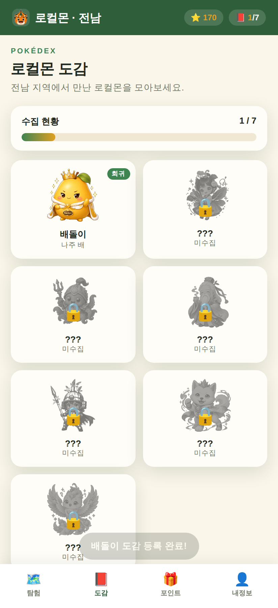
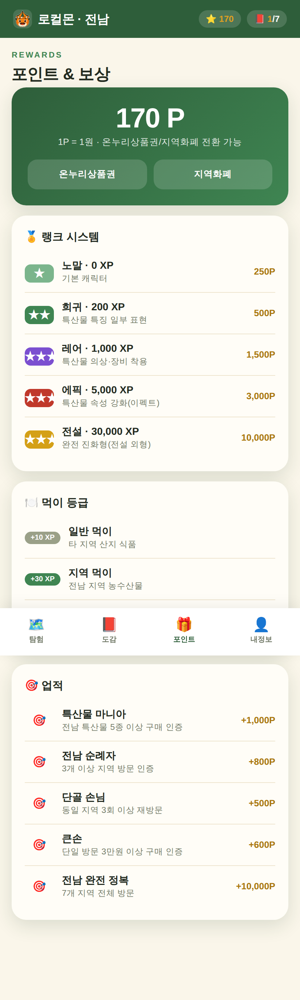
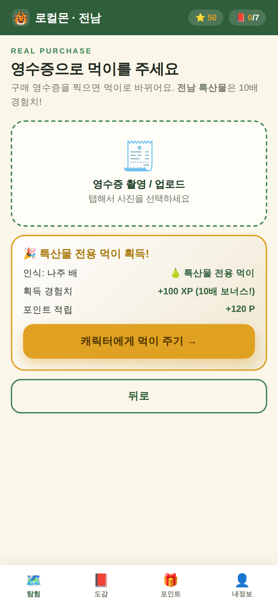
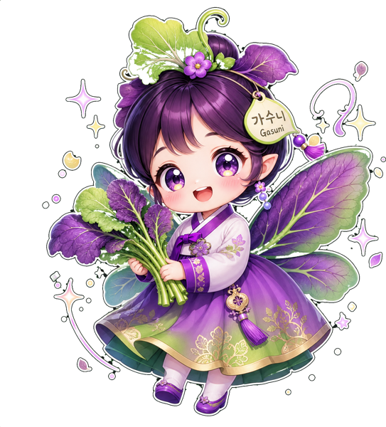
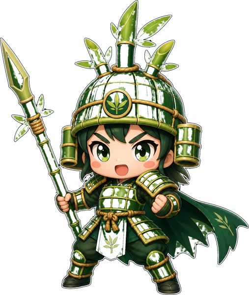
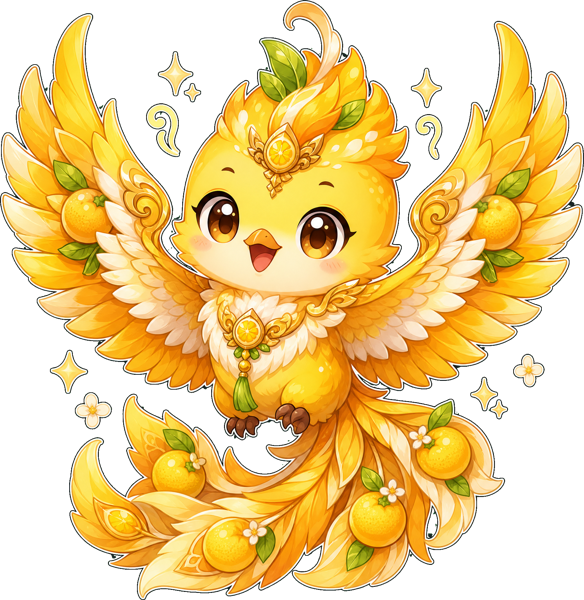

<div align="center">



# 🏮 로컬몬 · 전남 (Local-Mon : Jeonnam)

**전라남도 특산물 캐릭터 수집형 지역소개 AI 서비스**

전통시장을 직접 방문하고, 실제로 구매할수록 캐릭터가 성장하는<br/>
위치기반 탐험 서비스로 지역 경제 활성화에 기여합니다.

<br/>


</div>

---

## 📌 한눈에 보기

> **"지역에서 실제로 물건을 살수록, 내 로컬몬이 자란다."**

로컬몬 · 전남은 전라남도의 전통시장과 특산물을 게임으로 연결합니다.
사용자는 지역을 방문해 특산물 캐릭터 **‘로컬몬’**을 수집하고, **영수증을 인증**하면
캐릭터가 성장합니다. 특히 **전남 특산물을 구매하면 10배 경험치**를 주어,
게임을 즐기는 것이 곧 지역 소비로 이어지도록 설계했습니다.

| | |
|---|---|
|  **해결하려는 문제** | 특산물 인지도와 실제 구매의 괴리, 지역 상권 약화, 관광 쏠림 |
|  **사용자** | 관광객·시민(수집·재미) / 외국인(다국어 안내) / 소상공인(실매출) |
| ️ **핵심 루프** | 방문 → 영수증 OCR → 먹이 변환 → 캐릭터 성장 → 포인트 → 재방문 |
|  **보상** | 포인트를 온누리상품권·지역화폐로 전환(1P = 1원) → 지역 내 재소비 |

---

## 📱 서비스 화면

| 탐험 (지도) | 캐릭터 성장 | 도감 | 포인트·랭크 |
|:---:|:---:|:---:|:---:|
|  |  |  |  |
| 전남 지도에서 지역 선택 | 특산물 구매로 성장 | 수집·미수집 도감 | 랭크·먹이·업적 |

<div align="center">

**영수증 인증 → 특산물 전용 먹이 획득**



</div>

---

##  핵심 메커니즘

```
지역 방문 (GPS 체크인)
      │
      ▼
영수증 촬영 ──► [CLOVA OCR] 품목 인식 ──► 전남 특산물 여부 판별
      │
      ▼
먹이 아이템 변환   일반(+10 XP) · 지역(+30 XP) · 특산물 전용(+100 XP)
      │
      ▼
캐릭터 성장 (랭크업)   노말 → 희귀 → 레어 → 에픽 → 전설
      │
      ▼
포인트 지급 ──► 온누리상품권·지역화폐 전환 ──► 지역 내 재소비 (선순환)
```

특산물 전용 먹이는 일반 먹이의 **10배 경험치**를 줍니다.
캐릭터를 빠르게 키우는 가장 효율적인 길이 곧 **전남 특산물 소비**가 되도록 하여,
게임 목표(캐릭터 육성)와 서비스 목표(특산물 소비 촉진)를 일치시켰습니다.

---

##  로컬몬 캐릭터

전남 각 지역의 대표 특산물을 모티브로 생성한 오리지널 캐릭터입니다.

| 캐릭터 | 지역 | 특산물 | 등급 |
|:---:|---|---|---|
|  배돌이 | 나주 남평장 | 나주 배 | ★★ 희귀 |
|  갓순이 | 여수 서시장 | 돌산갓 | ★★ 희귀 |
|  낙지왕 | 목포 남부시장 | 세발낙지 | ★★★ 레어 |
|  녹차선인 | 보성 벌교장 | 보성 녹차 | ★★★★ 에픽 |
|  죽순이 | 담양장 | 담양 대나무 | ★★ 희귀 |
|  진도댕이 | 진도읍장 | 진도개 | ★★★★★ 전설 |
|  유자봉 | 고흥장 | 고흥 유자 | ★★★★ 에픽 |

---

## 적용 AI 기술

| 모듈 | 기술 | 역할 |
|---|---|---|
| ① 캐릭터 생성·진화 | Generative AI · 이미지 분류 | 특산물 모티브 캐릭터 생성, 영수증 품목 인식 |
| ② 동적 핫스팟 | Predictive · 가중치 기반 | 소외 지역에 희귀 로컬몬 출현 확률 상향 |
| ③ 개인화 추천 | Collaborative Filtering | 방문 이력 기반 맞춤 미션 생성 |
| ④ 다국어 도슨트 | LLM · RAG · 기계번역 | 외국인에게 특산물 정보 다국어 안내 |

> 예선 프로토타입에서는 **① 영수증 OCR(CLOVA)**을 실제 구현하고,
> 나머지는 기획·설계 단계로 제시합니다.

---

##️ 기술 스택

- **Frontend** — HTML / CSS / Vanilla JavaScript (단일 페이지, 탭 기반)
- **Backend** — Node.js Serverless Function (Vercel)
- **OCR** — NAVER CLOVA OCR (영수증 품목 인식)
- **Deploy** — Vercel

### 활용 데이터
공공데이터포털·AI-Hub의 관광·상권·특산물 데이터 13종
(전통시장 표준데이터, 한국관광 데이터랩, 여행로그, 농산물 소매가격,
음식·상품 이미지, 다국어 번역·말뭉치 등)

---

## 실행 방법

```bash
# 로컬 실행 (이미지 표시를 위해 간단한 서버로 열기)
cd public
python3 -m http.server 8000
# → http://localhost:8000
```

### 배포 (Vercel)
1. 이 저장소를 Vercel에 Import
2. 환경변수 등록: `CLOVA_OCR_URL`, `CLOVA_OCR_SECRET`
3. Deploy → 발급된 URL로 접속

> 자세한 배포·수정 방법은 [`GUIDE.md`](./GUIDE.md) 참고.
> OCR 키가 없어도 데모 모드로 전체 흐름이 동작합니다.

---

## 👥 Team Strikers

> 볼링에서 핀을 한 번에 쓰러뜨리는 스트라이크처럼,
> 관광객·소비자·소상공인이라는 여러 핀을 하나의 서비스로 한 번에 해결한다.

| 이름 | 역할 | 소속 |
|---|---|---|
| 홍석훈 | 팀장 | 서울과학기술대학교 인공지능응용학과 |
| 강주경 | 팀원 | 서울과학기술대학교 인공지능응용학과 |
| 윤준호 | 팀원 | 서울과학기술대학교 인공지능응용학과 |
| 이수 | 팀원 | 서울과학기술대학교 인공지능응용학과 |

---

<div align="center">

**2026 AI+X융합 문제발굴 해커톤 · Track #2**
지역 산업·상권·특산물 — 광주·전남 지역 상권과 소비 경험을 혁신하는 AI 서비스

</div>
